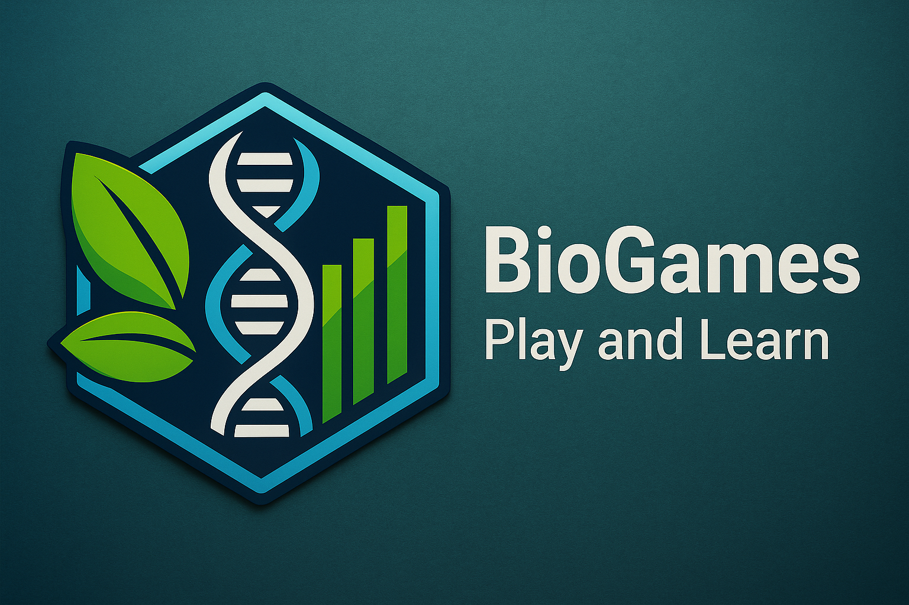

# BioGames | Play and Learn

**BioGames** is a collection of interactive, biology-themed web games built with **React** and **Next.js**. It is designed as an educational and entertaining platform to explore key biological concepts through gameplay.

> This repository is a continuation of [DEPRECATED-biogames](https://github.com/manumei/DEPRECATED-biogames-)

---

## 🎮 Released Games

### **Taxo Bingo**

*Given a Bingo-like grid of taxonomic classifications, match the organisms that appear on the screen with one that suits them. Fill all 12 cells to win the game!*

---

## 🔜 Coming Soon

These games are currently in development and will be released in future updates:

- **BioWordle**
- **Symptoms Link**
- **Bio Top8**
- **Animal Tic Tac Toe**
- **Cell Classifier**

---

## ⚙️ Tech Stack

- **Framework:** Next.js (React)
- **Language:** TypeScript
- **Styling:** Tailwind CSS
- **Hosting:** Vercel

---

## 🚧 Status

Active development. Contributions and feedback welcome once v1.0 is released.

---

#### Created by Manuel Meiriño
